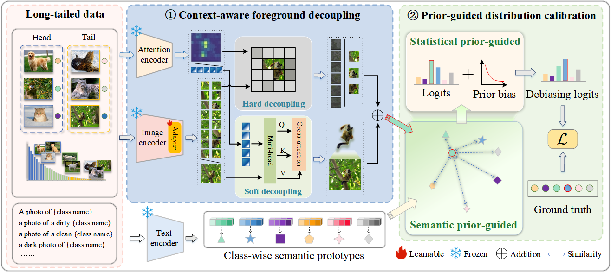

# DCFD: Distribution Calibration via Foreground Decoupling for Long-Tailed Recognition

## Overview

DCFD (Distribution Calibration via Foreground Decoupling) is a unified framework for long-tailed visual recognition that leverages pre-trained vision-language models (CLIP) and vision transformers (ViT) to improve classification performance on tail classes. The method comprises two core components:

1. **Foreground Decoupling**: Utilizes DINO self-attention maps to identify and retain informative foreground patches while suppressing background noise, encouraging the model to focus on discriminative object parts.
2. **Prior-Guided Distribution Calibration**: Jointly leverages semantic priors from visual-language models and statistical priors from class distributions to calibrate logits and mitigate head-class bias.

DCFD provides a flexible interface that supports various backbones, parameter-efficient fine-tuning (PEFT) strategies, head initialization methods, loss functions, and classifier types.



---

## Requirements

- Python 3.8+
- PyTorch 2.0
- Torchvision 0.15
- Tensorboard

### Setup

```bash
conda create -n dcfd python=3.8 -y
conda activate dcfd
conda install pytorch==2.0.0 torchvision==0.15.0 pytorch-cuda=11.7 -c pytorch -c nvidia
conda install tensorboard
pip install -r requirements.txt
```

### Dependency versions (if compatibility issues arise)

```
numpy==1.24.3
scipy==1.10.1
scikit-learn==1.2.1
yacs==0.1.8
tqdm==4.64.1
ftfy==6.1.1
regex==2022.7.9
timm==0.6.12
```

---

## Hardware

Most experiments can be reproduced with a single GPU (20 GB memory). Larger backbones (e.g., ViT-L) require more memory. Use `micro_batch_size` for gradient accumulation if memory is constrained.

---

## Quick Start

```bash
# CIFAR-100-LT (imbalance ratio = 100)
python main.py -d cifar100_ir100 -m clip_vit_b16_dcfd
```

This automatically downloads CIFAR-100 and runs DCFD with AdaptFormer (default PEFT) and foreground decoupling threshold τ=0.7.

---

## Usage

### Command-line interface

```bash
python main.py -d <dataset> -m <model> [options...]
```

- **`-d`** — dataset config name (matches a `.yaml` file in `configs/data/`)
- **`-m`** — model config name (matches a `.yaml` file in `configs/model/`)
- **`[options]`** — override any config key-value pairs (see below)

### Available datasets

| Config name | Dataset | Notes |
|-------------|---------|-------|
| `imagenet_lt` | ImageNet-LT | 1000 classes, long-tailed |
| `places_lt` | Places-LT | 365 scene categories |
| `inat2018` | iNaturalist 2018 | Fine-grained species (8142 classes) |
| `cifar100_ir100` | CIFAR-100-LT (ρ=100) | Imbalance ratio 100 |
| `cifar100_ir50` | CIFAR-100-LT (ρ=50) | Imbalance ratio 50 |
| `cifar100_ir10` | CIFAR-100-LT (ρ=10) | Imbalance ratio 10 |
| `isic2018` | ISIC 2018 | Skin lesion classification |

## Datasets

### Prepare data

Download [Places](http://places2.csail.mit.edu/download.html), [ImageNet](http://image-net.org/index), [iNaturalist 2018](https://github.com/visipedia/inat_comp/tree/master/2018), and [ISIC 2018](https://challenge2018.isic-archive.com/). Organize as follows:

**ImageNet-LT**
```
Path/To/Dataset/
├── train/
│   ├── n01440764/
│   │   ├── n01440764_18.JPEG
│   │   └── ...
│   └── ...
├── val/
│   ├── n01440764/
│   │   ├── ILSVRC2012_val_00000293.JPEG
│   │   └── ...
│   └── ...
├── classnames.txt
└── fine2coarse.json
```

**Places-LT**
```
Path/To/Dataset/
├── train/
│   ├── airfield/
│   │   ├── 00000001.jpg
│   │   └── ...
│   └── ...
└── val/
    ├── airfield/
    │   ├── Places365_val_00000435.jpg
    │   └── ...
    └── ...
```

**iNaturalist 2018**
```
Path/To/Dataset/
└── train_val2018/
    ├── Actinopterygii/
    │   ├── 2229/
    │   │   ├── 2c5596da5091695e44b5604c2a53c477.jpg
    │   │   └── ...
    │   └── ...
    └── ...
├── categories.json
├── iNaturalist18_train.txt
└── iNaturalist18_val.txt
```

**ISIC 2018**
```
Path/To/Dataset/
├── ISIC2018_train.txt
├── ISIC2018_test.txt
├── classnames.txt
└── (image directories)
```

Update the `root` path in the corresponding YAML file under `configs/data/`.

---

## Reproduction

```bash
# DCFD on ImageNet-LT
python main.py -d imagenet_lt -m clip_vit_b16_dcfd

# DCFD on Places-LT
python main.py -d places_lt -m clip_vit_b16_dcfd

# DCFD on iNaturalist 2018
python main.py -d inat2018 -m clip_vit_b16_dcfd

# DCFD on CIFAR-100-LT
python main.py -d cifar100_ir100 -m clip_vit_b16_dcfd
python main.py -d cifar100_ir50 -m clip_vit_b16_dcfd
python main.py -d cifar100_ir10 -m clip_vit_b16_dcfd
```
---

## DCFD: DINO-CLIP Fusion Module

The DCFD model (`configs/model/clip_vit_b16_dcfd.yaml`) extends the base framework with a DINO self-supervised vision transformer for improved long-tail recognition:

- **DINO Attention Filtering**: Uses DINO's self-attention map to identify and retain foreground patches, suppressing background noise.
- **Cross-Attention Fusion**: Fuses CLIP and DINO class tokens via a multi-head cross-attention module.

The `note` parameter controls the DCFD variant:
- `our_X` — Full DCFD with patch filtering threshold `X` (default 0.7)
- `only-dino` — DINO attention filtering only (no fusion module)
- `only-head` — Cross-attention fusion only (no patch filtering)
- `baseline` — Base model without DCFD components
- `only-hard` — Uses hard sample filtering variant

> **Note**: DINO pretrained weights (`pretrained/dino_vitbase16_pretrain.pth`) are required. Download from the [official DINO repository](https://github.com/facebookresearch/dino).

## Acknowledgment

Code references: [Classifier-Balancing](https://github.com/facebookresearch/classifier-balancing), [CoOp](https://github.com/KaiyangZhou/CoOp), [DINO](https://github.com/facebookresearch/dino).
